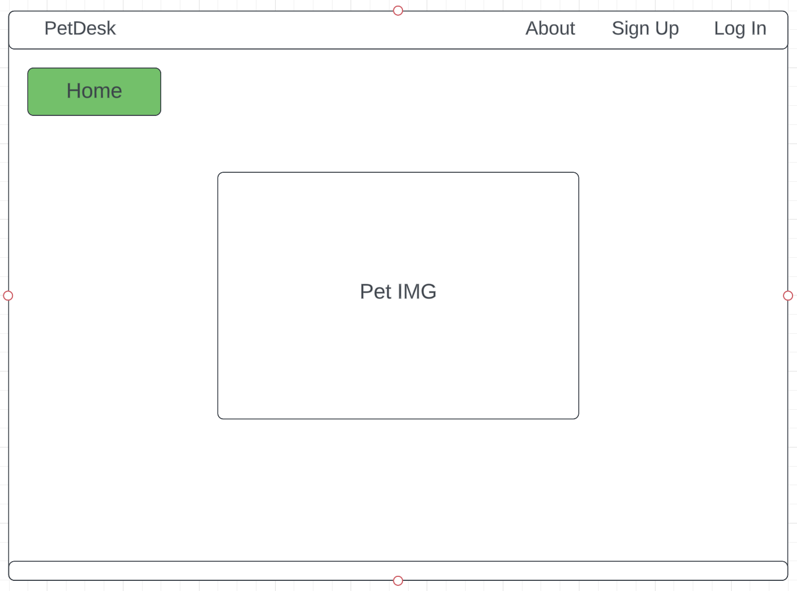
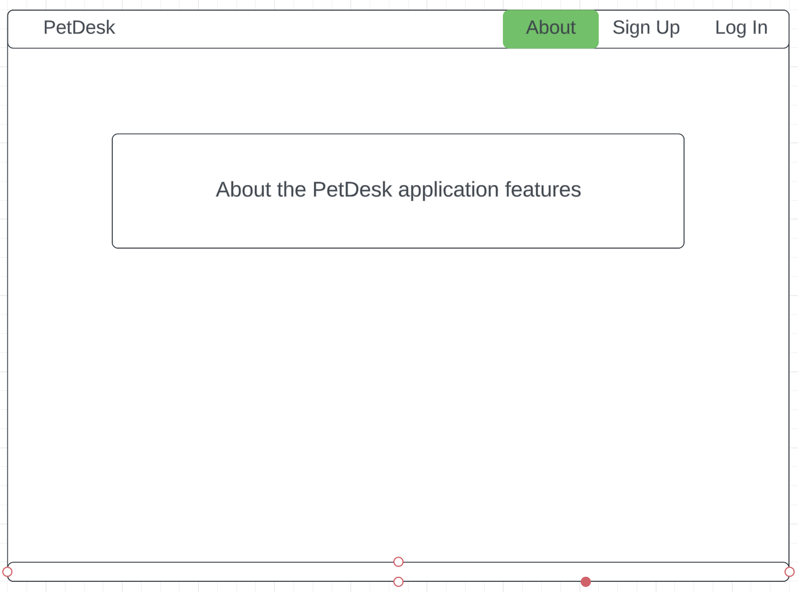
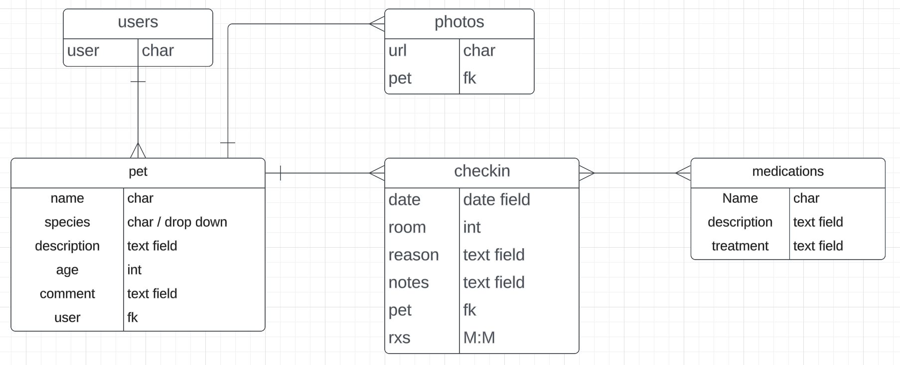
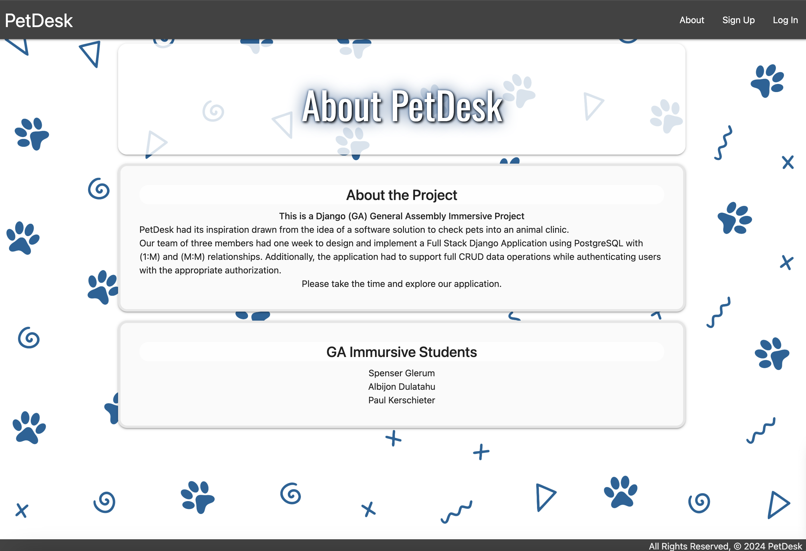

# PetDesk
Petdesk is a veterinary application to manage pets for use by the veterinary staff at the clinic. It allows for checking in and out as well as tracking medications and room assignments. 

# App URL:
 - Coming soon

# Git Hub Link
  - https://github.com/da1dude/petdesk

# User Stories
  - As a user, I want the ability to sign up.
  - As a user, I want the ability to sign in. 
  - As a user, I want the ability to sign out. 
  - As a user, I want the ability to create Pets.
  - As a user, I want the ability to view all pets in a list.
  - As a user, I want the ability to read more details of individual Pets.
  - As a user, I want the ability to update Pets.  
  - As a user, I want the ability to delete Pets. 
  - As a user, I want the ability to add descrtions to Pets.
  - As a user, I want the ability to update descrtions to Pets.
  - As a user, I want the ability to descrtions to Pets.
  - As a user, I want the ability to check in Pets.
  - As a user, I want the ability to check out Pets.
  - As a user, I want the ability to add Vaccines / Meds for Pets
  - As a user, I want the ability to remove Vaccines / Meds for Pets

# Wire Frame

# ERD

# Technologies Used

- JavaScript
- Django
- Python
- JS
- Postgres SQL
- CSS3
- Materalize

# V1 Images

# ICE BOX

- UI enhancements
- Better way to add medications
